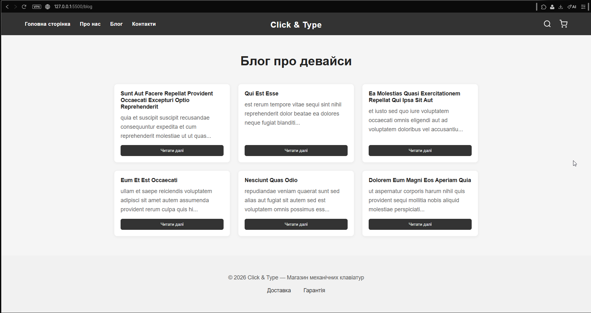
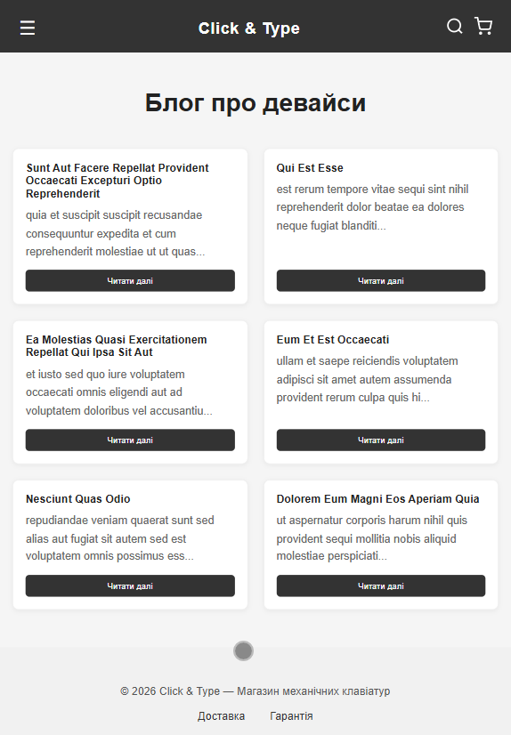
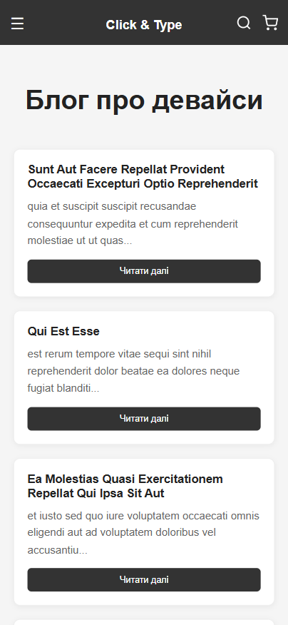

# Практична робота №6: Інтеграція Web-інтерфейсу з REST API

## 1. Мета проєкту

Навчитися працювати з зовнішніми сервісами через REST API. Реалізувати асинхронні запити за допомогою Fetch API, освоїти обробку JSON-відповідей та впровадити механізми обробки помилок і станів завантаження (loading states) у SPA-архітектуру.

## 2. Інтеграція з REST API

Для роботи було обрано публічне API JSONPlaceholder. Проєкт імітує отримання динамічного контенту (статей блогу) з сервера.

- Endpoint: https://jsonplaceholder.typicode.com/posts
- Метод: GET
- Обмеження: Отримується 6 елементів `(?\_limit=6)` для оптимізації відображення.

---

## 3. Оновлена модульна структура

До існуючої архітектури додано новий рівень взаємодії з даними:

- api.js (Модуль роботи з мережею):

  - Винесений в окремий файл для логічного розділення API-логіки.
  - Містить асинхронну функцію fetchPosts, яка використовує fetch для отримання даних.
  - Реалізує первинну перевірку статусу відповіді сервера (response.ok).

- pages.js (Доповнення):

  - Додано шаблон сторінки Блогу.
  - Реалізовано допоміжну функцію renderPostCards, яка використовує метод .map() для динамічної генерації HTML-карток на основі масиву об'єктів з API.

- router.js (Розширення логіки):
  - Додано функцію loadBlogData, яка керує життєвим циклом сторінки блогу: ініціює запит, обробляє результат та вставляє готовий контент у DOM.
  - Реалізовано перевірку поточного шляху для автоматичного запуску асинхронного завантаження.

---

## 4. Асинхронна логіка та UX

У проєкті реалізовано підхід до обробки мережевих запитів:

1. Async/Await: Використання асинхронних функцій гарантує відсутність блокуючих операцій — інтерфейс залишається чуйним, поки дані завантажуються у фоновому режимі.
2. Loading State: Поки очікується відповідь від сервера, користувач бачить індикатор завантаження ("Завантаження статей..."), що покращує UX.
3. Обробка помилок (Error Handling): - Використано конструкцію try...catch для перехоплення помилок мережі або сервера.

---

## 5. Технічні особливості реалізації

- Форматування даних: Оскільки тексти з API можуть бути занадто довгими, використано метод substring(0, 100) для створення анонсів постів однакового розміру.
- Склеювання шаблонів: Використано .join("") для перетворення масиву HTML-рядків у єдиний рядок для вставки в innerHTML.

---

## 6. Скриншоти

**Вигляд cторінки Блог на Компьютері**

**Вигляд cторінки на Планшеті**

**Вигляд cторінки на телефоні**

